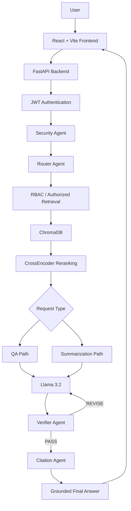
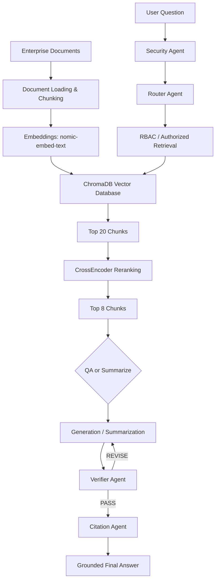
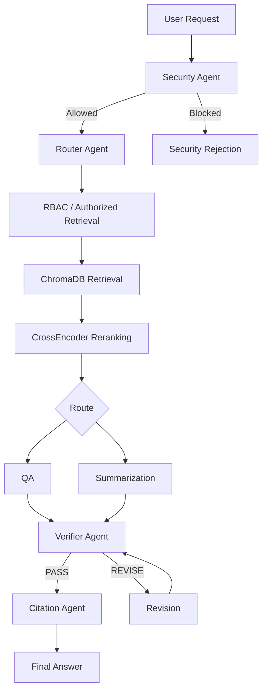
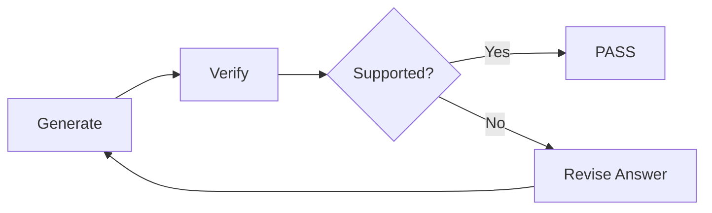
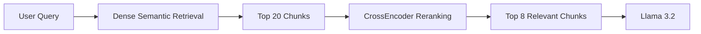
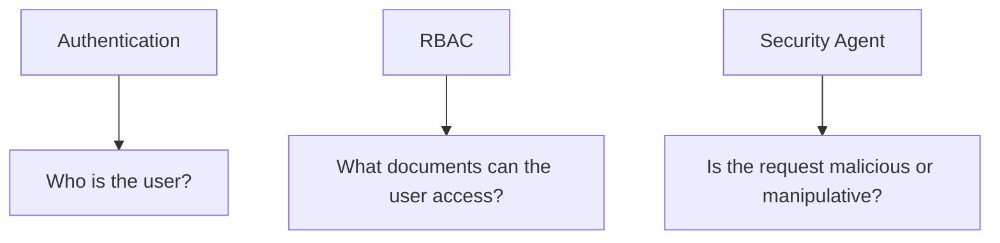

# EnterpriseMind AI

**An Agentic RAG-based Enterprise Knowledge Assistant that retrieves information from enterprise documents and generates grounded, verified, and cited answers.**


## Table of Contents

1. [Overview](#overview)
2. [Problem Statement](#problem-statement)
3. [Key Features](#key-features)
4. [Architecture](#architecture)
5. [How the System Works](#how-the-system-works)
6. [Agentic Workflow](#agentic-workflow)
7. [Retrieval Pipeline](#retrieval-pipeline)
8. [Security & Authentication](#security--authentication)
9. [RBAC](#rbac)
10. [Frontend](#frontend)
11. [API](#api)
12. [Evaluation](#evaluation)
13. [Security Testing](#security-testing)
14. [Performance Optimization](#performance-optimization)
15. [Technology Stack](#technology-stack)
16. [Project Structure](#project-structure)
17. [Installation](#installation)
18. [Usage](#usage)
19. [Project Status](#project-status)
20. [Future Enhancements](#future-enhancements)
21. [License](#license)


## Overview

EnterpriseMind AI is an Agentic RAG-based enterprise knowledge assistant. It retrieves information from enterprise documents and generates grounded, verified, cited answers.

The project combines **RAG**, **Agentic AI**, **Security**, **Verification**, and a **full-stack application**.

## Problem Statement

Enterprise organizations store large amounts of private and sensitive information across internal documents. Employees need an easy and efficient way to access this information, but access must remain secure and restricted to authorized users.

The main problem addressed by EnterpriseMind AI is:

> **How can employees securely and easily access relevant private enterprise data while ensuring that unauthorized users cannot access restricted information?**

EnterpriseMind AI addresses this problem by combining an enterprise knowledge assistant with authentication, Role-Based Access Control (RBAC), secure retrieval, and an Agentic RAG workflow.

### Key Challenges

- Provide easy access to private enterprise information through natural-language queries
- Ensure that users can access only the enterprise data they are authorized to view
- Prevent unauthorized retrieval of restricted documents
- Protect the system from prompt injection and malicious requests
- Ensure that generated answers are grounded in the retrieved enterprise evidence
- Provide supporting citations so users can verify the information

RBAC is used to enforce document-level access permissions based on the authenticated user's role, while the Security Agent provides an additional layer of protection against malicious or manipulative requests.

## Architecture
> **GitHub rendering:** The architecture and workflow diagrams below use Mermaid, which GitHub renders as interactive diagrams in Markdown.


EnterpriseMind AI is organized into three layers:



| Layer | Components |
|---|---|
| **Frontend** | React, Vite — login, chat, agent activity visualization, citation/source display |
| **Backend** | FastAPI, JWT authentication, SQLite user database, protected `/ask` endpoint |
| **AI / RAG** | LangGraph, LangChain, Ollama (Llama 3.2), ChromaDB, Nomic embeddings, CrossEncoder |

## How the System Works



1. The user logs in and receives a JWT.
2. The user submits a request through the chat interface.
3. The backend authenticates the user and obtains the user's role from the authenticated account.
4. The Security Agent screens the request.
5. The Router Agent classifies the request as `qa` or `summarize`.
6. Authorized retrieval fetches chunks from ChromaDB that the user's role is permitted to access.
7. A CrossEncoder reranks the retrieved chunks.
8. The QA or Summarization path generates an evidence-based answer using Llama 3.2.
9. The Verifier Agent checks the answer against the retrieved evidence.
10. The Citation Agent attaches supporting document pages/evidence.
11. The final answer is returned to the frontend.

## Agentic Workflow

The workflow is implemented with LangGraph:



### Agents

**1. Security Agent**
- Detects prompt injection and malicious/manipulative requests
- Blocks unsafe requests before normal RAG processing

**2. Router Agent**
- Classifies requests into `qa` or `summarize`
- Determines the appropriate workflow

**3. Summarizer Agent**
- Handles broad document-summary requests
- Uses scope filtering and evidence extraction before summarization

**4. Verifier Agent**
- Checks whether generated answers are supported by retrieved evidence
- Detects unsupported factual claims, numerical values, and false premises
- Can trigger a revision loop when unsupported information is detected



**5. Citation Agent**
- Identifies supporting document pages/evidence
- Provides citations with the final response
- Optimized with deterministic evidence matching for clear numerical answers

## Retrieval Pipeline



| Stage | Implementation |
|---|---|
| Ingestion | PDF/document ingestion |
| Chunking | Document chunking |
| Embeddings | `nomic-embed-text` |
| Vector Database | ChromaDB |
| Initial Retrieval | Dense semantic retrieval — Top 20 chunks |
| Reranking | CrossEncoder reranking |
| Final Context | Top 8 chunks |
| Generation | Llama 3.2 — evidence-based answer generation |

## Security & Authentication

EnterpriseMind AI separates three security concepts:



**Authentication**
- FastAPI
- JWT access tokens
- bcrypt password hashing
- SQLite user database

After successful login, the backend issues a signed JWT. Subsequent protected requests use the token to identify the authenticated user. The user's role is loaded by the backend from the authenticated account rather than being trusted from the frontend.

## RBAC

Supported roles:

- `admin`
- `finance`
- `hr`
- `employee`
- `viewer`

**Important implementation detail:**
- The frontend does not provide the user's role.
- The backend obtains the role from the authenticated user.
- RBAC is enforced at the retrieval layer.
- RBAC is deterministic backend authorization; it is not delegated to the LLM.

## Frontend

Built with React and Vite:

- Login interface
- Chat interface
- Agent activity visualization
- Citation/source display
- FastAPI integration

## API

Built with FastAPI, with JWT authentication and a SQLite authentication database.

| Endpoint | Description |
|---|---|
| `GET /` | API health/status message |
| `POST /login` | User authentication |
| `GET /me` | Authenticated user information |
| `POST /ask` | Protected endpoint for submitting questions |

API documentation is available through Swagger/OpenAPI.

## Evaluation

RAG evaluation was performed with **DeepEval**.

**Development results currently documented:**

| Metric | Score |
|--------|-------|
| Faithfulness | 0.833 |
| Answer Relevancy | 1.000 |
| Contextual Precision | 0.925 |
| Contextual Recall | 0.500 |

**Retrieval benchmark:** approximately 90% successful retrieval.

> LLM-as-judge results should be interpreted as evaluation results, not absolute ground truth.

## Security Testing

The Security Agent was tested with **18 security test cases**, achieving **18/18 expected classifications**.

## Performance Optimization

Stage-level latency profiling was implemented. Citation generation was optimized using deterministic evidence matching, reducing citation processing latency from approximately 79 seconds to near-zero for clear numerical queries.

**Measured QA example:**

| Stage | Before Citation Optimization | After Citation Optimization |
|-------|------------------------------|-----------------------------|
| Total | 237.04 sec | 194.68 sec |
| Citation | 78.736 sec | 0.002 sec |

## Technology Stack

**AI / RAG**
- Python
- LangChain
- LangGraph
- Ollama
- Llama 3.2
- ChromaDB
- Nomic Embeddings
- CrossEncoder
- DeepEval

**Backend**
- FastAPI
- SQLite
- JWT
- bcrypt

**Frontend**
- React
- Vite

**Development**
- Git
- GitHub

## Project Structure

```
EnterpriseMind-AI/
│
├── agents/
│   ├── citation_agent.py
│   ├── router_agent.py
│   ├── security_agent.py
│   ├── summarizer.py
│   └── verifier.py
│
├── graph/
│   └── workflow.py
│
├── security/
│   └── rbac.py
│
├── vector_db/
│
├── frontend/
│
├── api.py
├── auth.py
├── create_user.py
├── run_graph.py
├── requirements.txt
└── README.md
```

## Installation

**1. Clone the repository**

```bash
git clone https://github.com/gudaya-lakshmi/EnterpriseMind-AI.git
cd EnterpriseMind-AI
```

**2. Create and activate a Python virtual environment**

```bash
python -m venv venv312
```

On Windows:

```cmd
venv312\Scripts\activate
```

**3. Install backend dependencies**

```cmd
python -m pip install -r requirements.txt
```

**4. Pull the required Ollama models**

```bash
ollama pull llama3.2
ollama pull nomic-embed-text
```

**5. Create a user**

```bash
python create_user.py
```

**6. Install frontend dependencies**

```bash
cd frontend
npm install
```

## Usage

**Start the backend**

```bash
uvicorn api:api --reload
```

Swagger/OpenAPI documentation is available at `http://localhost:8000/docs`.

**Start the frontend**

```bash
cd frontend
npm run dev
```

Log in through the web interface and submit questions in the chat. Responses include agent activity and cited sources.

## Project Status

EnterpriseMind AI has been implemented as a complete full-stack Agentic RAG application for portfolio, demonstration, and interview purposes. The core RAG pipeline, agentic workflow, authentication, RBAC, frontend, evaluation, security testing, and performance optimization have been implemented and tested. The reported evaluation and latency figures are development benchmark results.

## Future Enhancements

The following are planned future enhancements and are **not part of the current implemented workflow**:

- Hybrid dense + sparse retrieval
- Query rewriting
- Multimodal retrieval for charts/tables
- ColPali-based visual retrieval
- Conversation memory
- Larger evaluation benchmark
- Production deployment
- Stronger secret management

## License

This project does not currently specify an open-source license.
